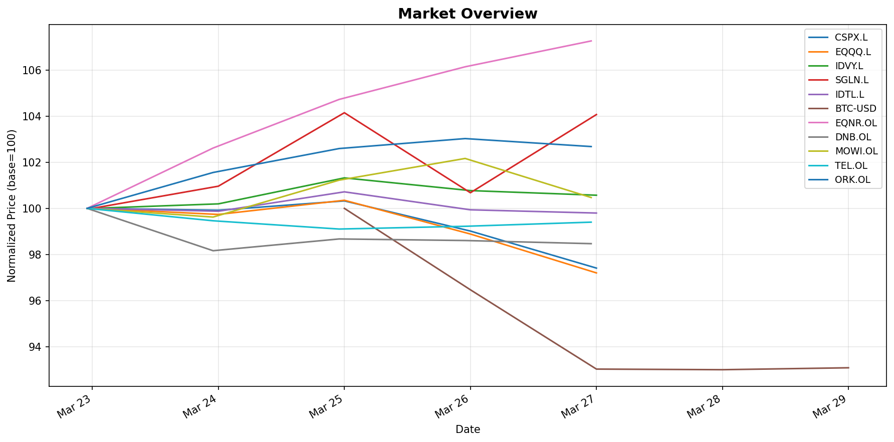
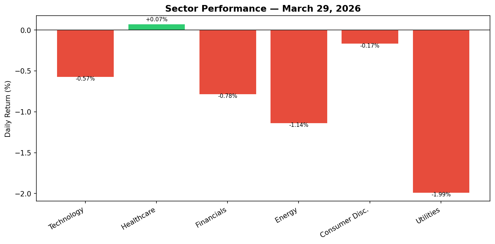

# Daily Investment Report — March 29, 2026

*Generated: 2026-03-29 18:50 UTC*

## Market Summary

| Ticker | Last Close | 5-Day Change |
|--------|-----------|-------------|
| SPY | 634.09 | -3.25% |
| QQQ | 562.58 | -4.32% |
| DIA | 451.39 | -2.29% |
| GLD | 414.70 | +2.64% |
| TLT | 85.64 | -0.87% |
| BTC-USD | 66,365.83 | -6.93% |

## Price Performance (5-Day)

## Sector Performance

## Sector Detail

| Sector | ETF | Daily Return |
|--------|-----|-------------|
| Technology | XLK | -1.95% |
| Healthcare | XLV | -1.70% |
| Financials | XLF | -2.53% |
| Energy | XLE | +1.69% |
| Consumer Discretionary | XLY | -2.89% |
| Utilities | XLU | +0.57% |

## Market Commentary — March 29, 2026

**Risk-off tone dominates to close the week.** Equities sold off broadly across the 5-day period, with growth and cyclical sectors leading the decline. The pattern is consistent with institutional de-risking ahead of anticipated macro headwinds.

**Key observations:**

- **Broad equity weakness**: SPY (-3.25%), QQQ (-4.32%), and DIA (-2.29%) all posted meaningful 5-day losses. The Nasdaq underperforming the Dow by roughly 200 bps suggests continued pressure on high-duration tech and growth assets — likely a repricing of rate-cut expectations.

- **Gold surges as safe-haven demand rises**: GLD up +2.64% over the week stands out as the clearest signal of defensive repositioning. Notably, gold and bonds are diverging — TLT is down -0.87% — suggesting the flight is to inflation-protected hard assets rather than a pure flight-to-quality. This is consistent with a "stagflation fear" narrative.

- **Bitcoin selloff mirrors risk assets**: BTC-USD down -6.93% over 5 days tracks closely with the QQQ, reinforcing the view that crypto continues to trade as a high-beta risk asset rather than a hedge.

- **Defensive sector rotation confirmed**: Energy (+1.69%) and Utilities (+0.57%) are the only sector ETFs in the green on a daily basis. Financials (-2.53%) and Consumer Discretionary (-2.89%) are the biggest daily laggards, which aligns with concerns about lending conditions and consumer spending resilience.

**Outlook**: The combination of gold strength, equity weakness, and a flat-to-down bond market suggests the market is navigating a difficult macro backdrop with persistent inflation fears alongside growth concerns. Sectors with pricing power (Energy) and regulated income streams (Utilities) are likely to continue outperforming near-term. Watch for any Fed commentary or macro data releases next week that could shift the rate expectations narrative.

---
*Data sourced from Yahoo Finance via yfinance. Not financial advice.*