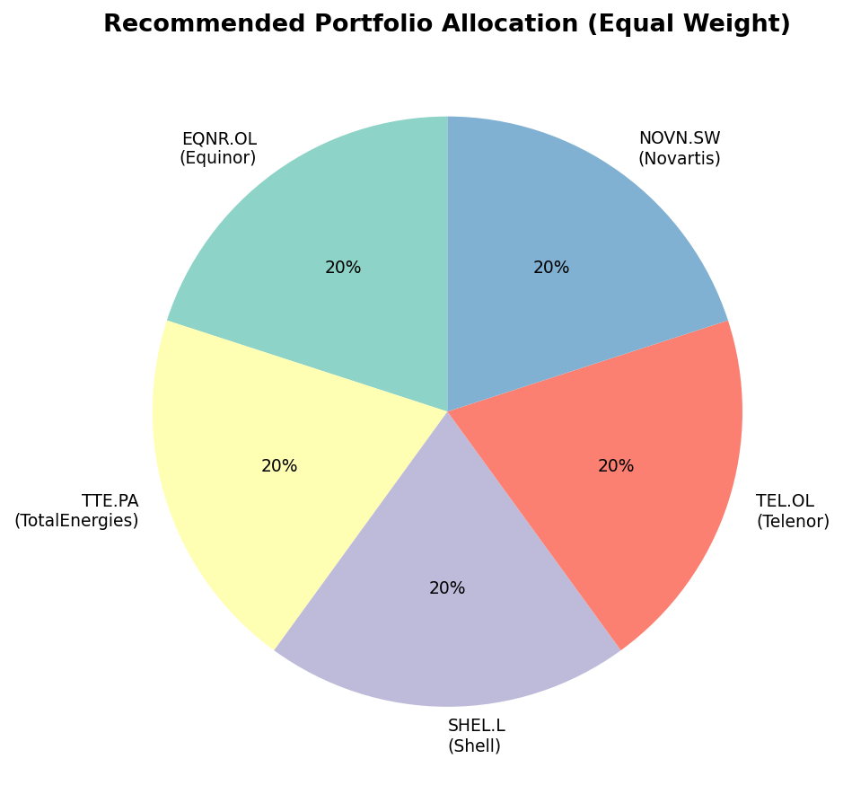
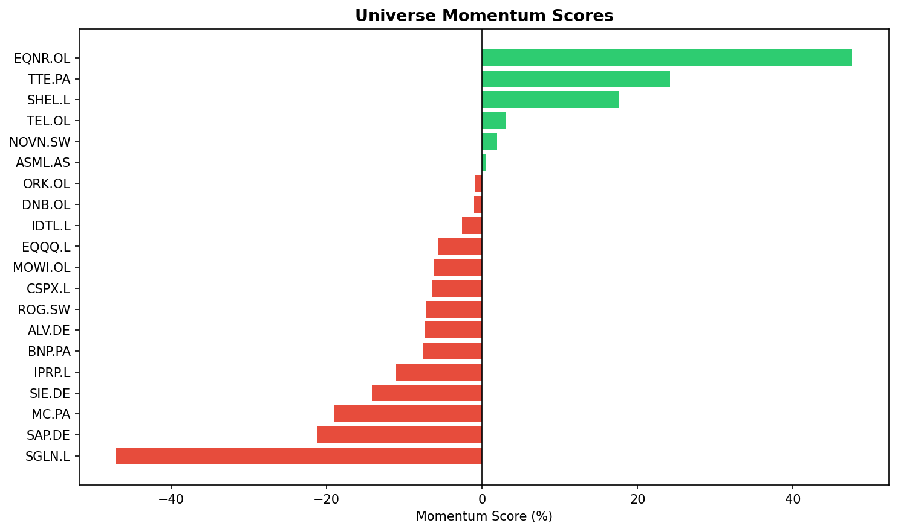

# Monthly Portfolio Recommendation — March 2026

*Generated: 2026-03-29 19:21 UTC*

## Executive Summary

This month's portfolio selects the top 5 securities from our universe of 20 assets, ranked by risk-adjusted momentum. All positions are equal-weighted.

## Portfolio Changes

_No previous portfolio data found. This is the first run — all positions are new entries._

### Buy (new positions)

| Ticker | Name | Weight |
|--------|------|--------|
| EQNR.OL | Equinor | 20.0% |
| TTE.PA | TotalEnergies | 20.0% |
| SHEL.L | Shell | 20.0% |
| TEL.OL | Telenor | 20.0% |
| NOVN.SW | Novartis | 20.0% |

## Recommended Portfolio

| Rank | Ticker | Name | Last Price | Momentum | Volatility |
|------|--------|------|-----------|----------|-----------|
| 1 | EQNR.OL | Equinor | $401.70 | +47.6% | 30.8% |
| 2 | TTE.PA | TotalEnergies | $78.49 | +24.2% | 19.6% |
| 3 | SHEL.L | Shell | $3,482.00 | +17.6% | 18.9% |
| 4 | TEL.OL | Telenor | $166.30 | +3.1% | 20.3% |
| 5 | NOVN.SW | Novartis | $119.14 | +1.9% | 18.7% |

## Full Universe Ranking

| Rank | Ticker | Name | Momentum | Volatility | Sharpe Proxy |
|------|--------|------|----------|-----------|-------------|
| 1 | EQNR.OL | Equinor | +47.6% | 30.8% | 1.55 |
| 2 | TTE.PA | TotalEnergies | +24.2% | 19.6% | 1.24 |
| 3 | SHEL.L | Shell | +17.6% | 18.9% | 0.93 |
| 4 | TEL.OL | Telenor | +3.1% | 20.3% | 0.15 |
| 5 | NOVN.SW | Novartis | +1.9% | 18.7% | 0.10 |
| 6 | ASML.AS | ASML | +0.4% | 36.7% | 0.01 |
| 7 | ORK.OL | Orkla | -1.0% | 18.5% | -0.05 |
| 8 | DNB.OL | DNB | -1.1% | 17.4% | -0.06 |
| 9 | IDTL.L | US Treasury 20Y UCITS | -2.6% | 10.1% | -0.26 |
| 10 | BNP.PA | BNP Paribas | -7.6% | 27.1% | -0.28 |
| 11 | ROG.SW | Roche | -7.2% | 24.4% | -0.29 |
| 12 | MOWI.OL | Mowi | -6.3% | 20.9% | -0.30 |
| 13 | SGLN.L | Physical Gold | -47.1% | 130.7% | -0.36 |
| 14 | EQQQ.L | Nasdaq-100 UCITS | -5.7% | 15.5% | -0.37 |
| 15 | ALV.DE | Allianz | -7.4% | 19.5% | -0.38 |
| 16 | SIE.DE | Siemens | -14.2% | 30.9% | -0.46 |
| 17 | CSPX.L | S&P 500 UCITS | -6.4% | 11.7% | -0.55 |
| 18 | SAP.DE | SAP | -21.2% | 34.8% | -0.61 |
| 19 | MC.PA | LVMH | -19.1% | 30.8% | -0.62 |
| 20 | IPRP.L | European Property UCITS | -11.1% | 15.1% | -0.73 |

## Methodology

- **Momentum score**: weighted average of 1-month (60%) and 3-month (40%) price returns.
- **Volatility**: annualised standard deviation of daily returns.
- **Risk-adjusted momentum (Sharpe proxy)**: momentum ÷ volatility.
- Portfolio = top N securities by Sharpe proxy, equal-weighted.

---
*Data sourced from Yahoo Finance via yfinance. Not financial advice.*